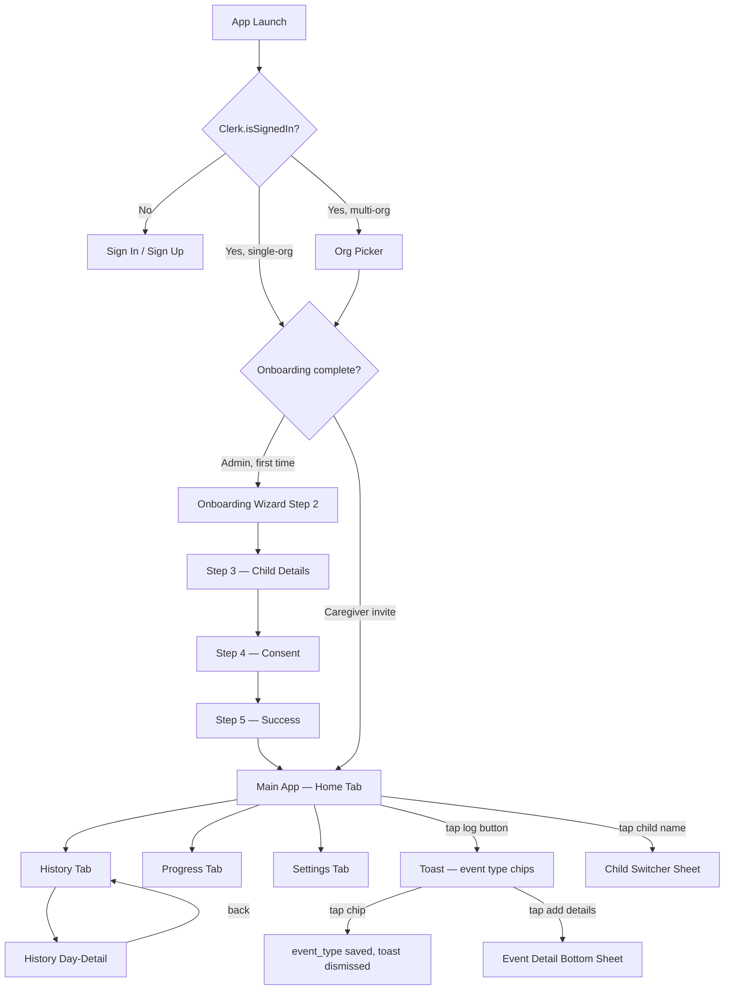
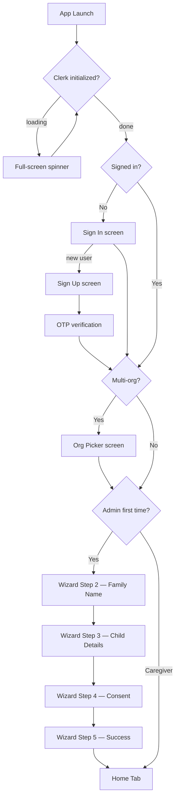

# Phase 4: UI/UX Design - Research

**Researched:** 2026-06-29
**Domain:** Design documentation — mobile UI spec artifacts for Jetpack Compose (Android) + SwiftUI (iOS)
**Confidence:** HIGH

---

<user_constraints>
## User Constraints (from CONTEXT.md)

### Locked Decisions
- D-01: Design language is calm & minimal as the base, with playfulness reserved for celebration moments only (milestone badge unlocks, streak achievements). Day-to-day UI is clean and understated.
- D-02: Primary accent color is warm purple/violet — used on the log button, tab active states, and CTAs. The supporting palette extends from primary-50 through primary-900 in purple/violet tints.
- D-03: Typography uses system fonts only — SF Pro on iOS (SwiftUI), Roboto on Android (Compose). No custom fonts.
- D-04: Corner radii are 12–16dp — soft but not bubbly.
- D-05: Icon style is outlined (stroke) icons throughout.
- D-06: Dark mode default is system/auto.
- D-07: Milestone/celebration visual treatment is badge glow + gentle animation — no confetti or particle effects.
- D-08: Design language is unified with documented platform-specific exceptions.
- D-09: Bottom tab bar is bottom-anchored on both platforms.
- D-10: Back navigation is platform-specific — iOS NavigationStack swipe; Android system predictive back gesture.
- D-11: "Add event details" sheet is platform-specific — iOS .sheet; Android ModalBottomSheet.
- D-12: Haptic feedback covers key interactions only: log button tap, milestone badge unlock, and error states.
- D-13: Accessibility spec requires full a11y annotations per component.
- D-14: Safe area handling uses standard safe area insets everywhere.
- D-15: Log button is a wide pill button — approximately 70–80% screen width.
- D-16: Log button tap feedback: haptic + scale-down press animation + persistent inline toast.
- D-17: Post-log toast is long-lived (~12s) with inline event type quick-pick chips.
- D-18: Event detail bottom sheet field order: event type selector → text note → time adjustment → Save button.
- D-19: Home screen layout (non-scrollable): child name header → today's event count → combined status chips → wide log button → bottom tab bar.
- D-20: Combined status area shows two small side-by-side chips when active; hidden when both zero.
- D-21: Event cards in History day-detail view are compact — no caregiver name shown.
- D-22: Child switcher: child name in home header is tappable with a chevron indicator; hidden for single-child families.
- D-23: Tokens live in a single DESIGN-TOKENS.md with a table per category. Each row: token name | Compose value | SwiftUI value.
- D-24: Color palette = semantic tokens + purple/violet scale (primary-50 through primary-900).
- D-25: Typography scale = 6 levels: Display, Headline, Title, Body, Label, Caption.
- D-26: Spacing grid = 8dp base: 8, 16, 24, 32, 48, 64.
- D-27: Heatmap intensity colors use purple tints (not type-specific per event).
- D-28: Elevation = 3 levels: flat (0dp), raised (2dp), overlay (8dp).
- D-29: Motion tokens are included in DESIGN-TOKENS.md: short (150ms), medium (300ms), long (400ms).
- D-30: Android uses Compose built-in animation APIs only — no Lottie or third-party.
- D-31: iOS uses SwiftUI built-in animation only — no Lottie or third-party.
- D-32: Tab switch transition: fade cross-dissolve, 100–150ms on both platforms.
- D-33: Log button press: scale to 0.95 on press, spring back on release.
- D-34: Badge glow animation: scale from 0.7x to 1.0x with spring curve + glow overlay. Total ~400ms.
- D-35: Bottom sheet open/close uses platform defaults.
- D-36: Toast enter/exit: slide up + fade in (200ms) / slide down + fade out (150ms).

### Claude's Discretion
- Icon set selection (which specific icon library/set to use — any outlined stroke icon set consistent with the aesthetic)
- Exact purple/violet hex values within the warm purple direction (primary-500 anchor value)
- Precise line-height and letter-spacing values for each typography level
- Event type icon designs (what each of pee/poo/both/accident types looks like as an icon)
- Empty state copy and illustration approach (text-only since no illustrations in calm/minimal direction)

Note: These discretion areas are already resolved in 04-UI-SPEC.md (the approved design contract). The planner does NOT need to re-decide them — just carry the UI-SPEC values through into the output artifacts.

### Deferred Ideas (OUT OF SCOPE)
None — discussion stayed within phase scope.
</user_constraints>

---

<phase_requirements>
## Phase Requirements

| ID | Description | Research Support |
|----|-------------|------------------|
| REQ-035 | Four-tab navigation — bottom tab bar with exactly four tabs (Home, History, Progress, Settings); tab icons, labels, and active/inactive states must be defined in Phase 4 UI spec; tab bar hidden during onboarding and full-screen detail flows | Screen flow diagram must show tab bar visibility rules; wireframes must show tab bar on every main-app screen; DESIGN-TOKENS.md must document tab active/inactive color tokens |
</phase_requirements>

---

## Summary

Phase 4 is a **documentation sprint**, not a code implementation phase. No Kotlin, Swift, or configuration files are written. The sole output is a set of markdown design-specification documents that Phase 5+ engineers implement from without making any design decisions.

The key insight is that the heavy design work is already done. The `04-UI-SPEC.md` is an approved, comprehensive design contract covering all 36 locked decisions, all 12 component specs, all screen layouts, the full color system, typography, spacing, motion tokens, accessibility annotations, platform-specific exceptions, and copywriting. Planning this phase means defining tasks that **transcribe those spec values into three standalone documentation files** that engineers will reference during implementation.

The three missing artifacts are: (1) `docs/DESIGN-TOKENS.md` — a standalone token reference extracted verbatim from UI-SPEC.md in the canonical D-23 table format; (2) `docs/SCREEN-FLOWS.md` — a Mermaid navigation diagram covering all user paths; and (3) `docs/WIREFRAMES.md` — ASCII-art lo-fi wireframes for all 22+ distinct screens and states. Component specs (Success Criterion 4) are already fully satisfied by UI-SPEC.md Section "Component Inventory" and require no separate file.

**Primary recommendation:** Plan 3–4 tasks in two waves. Wave 1 (parallelizable): produce DESIGN-TOKENS.md and SCREEN-FLOWS.md simultaneously. Wave 2 (depends on Wave 1 for cross-reference links): produce WIREFRAMES.md in two tasks split by screen group. Finish with a checklist-verification task that confirms every success criterion is satisfied and marks the UI-SPEC.md checker sign-off complete.

---

## Architectural Responsibility Map

Phase 4 is documentation-only. The "tiers" below are documentation layers rather than runtime tiers.

| Capability | Primary Owner | Secondary Owner | Rationale |
|------------|--------------|-----------------|-----------|
| Design token values | 04-UI-SPEC.md (source of truth) | docs/DESIGN-TOKENS.md (extraction) | Values are locked in UI-SPEC; DESIGN-TOKENS.md must reproduce them verbatim — not re-derive |
| Screen navigation flows | docs/SCREEN-FLOWS.md | REQUIREMENTS.md (screen list) | Navigation paths are derived from REQ-031 through REQ-036 and CONTEXT.md decisions |
| Per-screen layout specs | docs/WIREFRAMES.md | 04-UI-SPEC.md (component details) | Wireframes show layout; component details live in UI-SPEC Component Inventory |
| Component specs | 04-UI-SPEC.md (existing, complete) | docs/WIREFRAMES.md (callout refs) | UI-SPEC Component Inventory already satisfies Success Criterion 4 — no new file needed |
| Animation/navigation patterns | docs/SCREEN-FLOWS.md (flow) + docs/DESIGN-TOKENS.md (motion tokens) | 04-UI-SPEC.md (source) | Split: motion token values go in DESIGN-TOKENS.md; interaction flow descriptions go in SCREEN-FLOWS.md |

---

## Standard Stack

### Documentation Tooling

| Tool | Version | Purpose | Why Standard |
|------|---------|---------|--------------|
| Mermaid | Built into GitHub markdown | Screen flow diagrams | Renders in-browser without external tools; widely supported in markdown renderers; no install required [ASSUMED] |
| ASCII box-drawing art | N/A | Lo-fi wireframes | Text-only format survives any renderer; engineers can annotate inline; zero tooling dependency [ASSUMED] |
| Markdown tables | N/A | Token documentation | Canonical format specified by D-23; matches existing project docs style in `docs/` directory [VERIFIED: project codebase] |

### No Packages Required

This phase installs zero dependencies. All output is plain markdown. The Package Legitimacy Audit section is not applicable.

### Output File Locations

| File | Location | Rationale |
|------|----------|-----------|
| `DESIGN-TOKENS.md` | `docs/DESIGN-TOKENS.md` | Matches existing project convention (`docs/` is engineer-facing); D-23 specifies this filename |
| `SCREEN-FLOWS.md` | `docs/SCREEN-FLOWS.md` | Phase 5+ engineers reference during implementation; belongs in `docs/` |
| `WIREFRAMES.md` | `docs/WIREFRAMES.md` | Same rationale; single file avoids navigation fragmentation |

---

## Package Legitimacy Audit

Not applicable — Phase 4 installs no external packages. All output is markdown documentation.

| Package | Registry | Age | Downloads | Source Repo | Verdict | Disposition |
|---------|----------|-----|-----------|-------------|---------|-------------|
| (none) | — | — | — | — | — | — |

---

## Architecture Patterns

### System Architecture Diagram

```
04-UI-SPEC.md (approved design contract)
        │
        ├──► docs/DESIGN-TOKENS.md   (token extraction — mechanical)
        │           Token tables: Color | Typography | Spacing | Radii | Elevation | Motion
        │
        ├──► docs/SCREEN-FLOWS.md    (navigation diagram)
        │           Mermaid flowchart of all user paths
        │           Interaction flow descriptions (log → toast → sheet)
        │
        └──► docs/WIREFRAMES.md      (lo-fi screen layouts)
                    Group A: Auth + Org screens
                    Group B: Onboarding wizard steps
                    Group C: Home tab (all states) + toast + chips
                    Group D: History tab + Day-Detail
                    Group E: Progress tab + Settings (Admin + Caregiver)
                    Group F: Bottom sheets + loading + error states
                          │
                          └─► cross-references back to UI-SPEC.md component specs
```

### Recommended Output File Structure

```
docs/
├── DESIGN-TOKENS.md    (NEW — token reference, extracted from UI-SPEC.md)
├── SCREEN-FLOWS.md     (NEW — navigation diagram + interaction flows)
├── WIREFRAMES.md       (NEW — lo-fi wireframes for all 22+ screen/states)
├── 03-system-architecture.md    (existing)
├── 04-data-model.md             (existing)
├── 05-privacy.md                (existing)
├── 06-auth.md                   (existing)
└── 07-sync-and-notifications.md (existing)

.planning/phases/04-ui-ux-design/
├── 04-UI-SPEC.md                (approved — engineers reference this for component detail)
├── 04-CONTEXT.md                (planning artifact — not engineer-facing)
└── 04-RESEARCH.md               (this file)
```

### Pattern 1: DESIGN-TOKENS.md Structure

**What:** Six token tables — one per category — following the D-23 format exactly.
**When to use:** Each token row must be a verbatim extraction from the relevant UI-SPEC.md section.

```markdown
<!-- Source: 04-UI-SPEC.md §Color, §Typography, §Spacing, etc. -->

# Design Tokens — OneStepTwo

## Color Tokens

| Token | Compose (light) | Compose (dark) | SwiftUI (light) | SwiftUI (dark) |
|-------|----------------|----------------|-----------------|----------------|
| color.background | Color(0xFFFFFFFF) | Color(0xFF0E0A14) | Color(hex: "FFFFFF") | Color(hex: "0E0A14") |
| color.surface | Color(0xFFFAF5FF) | Color(0xFF1A1427) | ... | ... |
| ... | | | | |

## Typography Tokens

| Role | Size | Weight | Line Height | Compose TextStyle | SwiftUI Font |
|------|------|--------|-------------|-------------------|--------------|
| Display | 28sp/pt | SemiBold | 34sp/pt | headlineMedium (custom weight) | .title + .semibold |
| ... | | | | | |

## Spacing Tokens
...
## Corner Radius Tokens
...
## Elevation Tokens
...
## Motion Tokens
...
```

**Critical rule:** Token values come from UI-SPEC.md only. The task must not invent or re-derive any value.

### Pattern 2: Mermaid Screen Flow Diagram

**What:** A `flowchart TD` or `flowchart LR` diagram showing every navigation path.
**When to use:** SCREEN-FLOWS.md — one diagram for auth/onboarding, one for main app.

```markdown
<!-- Source: 04-UI-SPEC.md §Screen Inventory + §Navigation Patterns -->


```

### Pattern 3: ASCII Wireframe Format

**What:** Mobile-screen-bounded ASCII art with labeled component zones and callout annotations.
**When to use:** Every screen in WIREFRAMES.md follows this format.

```
<!-- Source: 04-UI-SPEC.md §Screen Inventory — Home Tab -->

### Home Tab — Standard State (single child, events logged)

```
┌────────────────────────────────────────┐
│ STATUS BAR (system insets)             │
├────────────────────────────────────────┤
│                                        │
│   Maya                                 │
│   · Title 20sp semibold                │
│   · no chevron (single child)          │
│                                        │
│         3                              │
│   · Display 28sp semibold              │
│   events today                         │
│   · Label 14sp, on-background          │
│                                        │
│   [2 need details]  [1 syncing…]      │
│   · Caption 12sp chips, secondary bg   │
│   · hidden when both counts = 0        │
│                                        │
│                                        │
│        ┌──────────────────┐            │
│        │       Log        │            │
│        └──────────────────┘            │
│   · color.primary bg, on-primary text  │
│   · 75% width, 52dp height, pill shape │
│   · 16dp gap above tab bar             │
│                                        │
├────────────────────────────────────────┤
│  Home  │ History │ Progress │ Settings │
│   ●    │         │          │          │
│ · active: color.primary icon + label   │
│ · inactive: on-surface 60% opacity     │
└────────────────────────────────────────┘
```
Ref: UI-SPEC §Home Tab, §Log Button (component 2), §Status Chips (component 8)
```

### Screen Inventory — Full List for Wireframes

The following 22 distinct screen/state wireframes are required. [VERIFIED: project codebase — derived from 04-UI-SPEC.md §Screen Inventory and success criteria SC #2]

**Group A — Auth + Org (6 wireframes):**
1. Sign In — default
2. Sign In — error / OTP step
3. Sign Up — default + error
4. Org Picker — list state
5. Org Picker — loading / error states
6. Invite Caregiver — default + success/error

**Group B — Onboarding Wizard (4 wireframes):**
7. Step 2 — Family name input
8. Step 3 — Child nickname + birth date selectors
9. Step 4 — Consent screen (self-attestation checkbox, plain-language copy)
10. Step 5 — Success/completion

**Group C — Home Tab + Overlays (4 wireframes):**
11. Home — single-child, no chips
12. Home — multi-child (chevron visible, chips active)
13. Toast — with 6 event type chips + body text
14. Home — empty state (new caregiver)

**Group D — History Tab (3 wireframes):**
15. History — heatmap with data (week labels, month labels, legend)
16. History — empty state
17. History Day-Detail — chronological event card list

**Group E — Progress + Settings (4 wireframes):**
18. Progress Tab — with data (streak, stats, 2×2 milestone badge grid)
19. Progress Tab — empty state
20. Settings Tab — Admin (4 sections: Family, Children, Notifications, Account)
21. Settings Tab — Caregiver (2 sections: Notifications, Account)

**Group F — Sheets + States (3 wireframes):**
22. Event Detail bottom sheet (all 4 fields visible)
23. Child Switcher bottom sheet
24. Loading state / Error state (generic patterns)

### Anti-Patterns to Avoid

- **Inventing new token values:** Every value in DESIGN-TOKENS.md must trace to a section in UI-SPEC.md. Never derive a new hex value, spacing value, or duration without a UI-SPEC source.
- **Re-opening design decisions in wireframes:** The wireframe task is layout transcription, not design. If a wireframe annotator is tempted to make a design choice, they must reference the UI-SPEC decision instead.
- **Omitting states:** Each screen has multiple states (loading, error, empty, populated). The "lo-fi wireframes" success criterion requires every distinct state — not just the happy path.
- **Putting component specs in a new file:** UI-SPEC.md §Component Inventory already fully satisfies Success Criterion 4. Creating a separate component doc duplicates content and risks divergence.
- **Combining SCREEN-FLOWS.md and WIREFRAMES.md:** The navigation diagram and the per-screen wireframes serve different readers — keep them in separate files so engineers can navigate to what they need.

---

## Don't Hand-Roll

| Problem | Don't Build | Use Instead | Why |
|---------|-------------|-------------|-----|
| Token color hex conversion to Compose/SwiftUI format | Custom hex-to-Color utility | Direct copy of values from UI-SPEC.md color table | Values are already expressed; conversion is transcription not computation |
| Screen flow state machine | Custom diagram syntax | Mermaid flowchart | Mermaid renders natively in GitHub markdown with no tool install [ASSUMED] |
| Mobile screen wireframe tool | Figma or design app | ASCII art in markdown code blocks | No design tooling in project scope; ASCII art is text-portable and version-controllable |
| Component spec document | New COMPONENTS.md | Reference UI-SPEC.md §Component Inventory | Already written and approved — duplication risks drift |

**Key insight:** This phase's hardest problem is scope control, not technical implementation. The temptation to re-open design decisions or expand scope (add more animation detail, create separate platform spec files, etc.) is the primary risk. Every task must start from UI-SPEC.md and produce only what the success criteria require.

---

## Common Pitfalls

### Pitfall 1: DESIGN-TOKENS.md Values Diverging from UI-SPEC.md

**What goes wrong:** A task author slightly mis-transcribes a hex value, duration, or typography size when copying from UI-SPEC.md to DESIGN-TOKENS.md. Phase 5 engineer uses DESIGN-TOKENS.md as their reference and implements a slightly different shade.

**Why it happens:** Manual copy-paste of 50+ token values with similar-looking numbers (e.g., #7E22CE vs #7E22CE — easy to transpose digits).

**How to avoid:** Each task that writes DESIGN-TOKENS.md must explicitly state the source line from UI-SPEC.md for every token row. The verification step must diff the final values against UI-SPEC.md.

**Warning signs:** DESIGN-TOKENS.md contains a hex value not found anywhere in UI-SPEC.md.

### Pitfall 2: Wireframes Missing States

**What goes wrong:** The Home Tab wireframe shows the happy-path layout but omits the empty state (new caregiver who has never logged an event) and the multi-child chevron variant. Success Criterion 2 requires "every distinct screen and state."

**Why it happens:** Screen state enumeration is easy to undercount. The wireframe author writes one layout and considers the screen "done."

**How to avoid:** Use the Screen Inventory in this research doc (22+ wireframes) as the explicit checklist. Each task should list every wireframe it will produce before writing them.

**Warning signs:** A screen in the inventory has no wireframe for its loading, error, or empty variant.

### Pitfall 3: The UI-SPEC.md Checker Sign-Off Is Still Marked "Pending"

**What goes wrong:** The bottom of 04-UI-SPEC.md has a `Checker Sign-Off` section with `**Approval:** pending`. STATE.md confirms the spec is approved. The discrepancy confuses Phase 5 engineers who might think the spec needs revision.

**Why it happens:** The checker approval was recorded in STATE.md but the in-file marker was not updated.

**How to avoid:** The final verification task in Phase 4 must update the UI-SPEC.md footer to `**Approval:** 2026-06-29 — all six dimensions PASS`. [VERIFIED: project codebase — observed in 04-UI-SPEC.md line 729]

**Warning signs:** 04-UI-SPEC.md still reads `**Approval:** pending` after Phase 4 closes.

### Pitfall 4: Screen Flow Mermaid Diagram Omits the Log → Toast → Sheet Flow

**What goes wrong:** The screen flow diagram covers page-level navigation (tab switches, push/pop) but omits the in-screen interaction flow: log button tap → SQLDelight write → toast appears → chip tap → type saved / sheet opens.

**Why it happens:** These interactions happen within the Home Tab screen and don't involve a navigation route change — easy to miss in a routing diagram.

**How to avoid:** SCREEN-FLOWS.md should include a second Mermaid diagram dedicated to the "within-Home-Tab interaction flow" showing the log → toast → sheet chain. This is explicitly listed in Phase 4 Success Criterion 1.

**Warning signs:** SCREEN-FLOWS.md shows only top-level tab navigation without the log-button interaction sub-flow.

### Pitfall 5: Motion Tokens in DESIGN-TOKENS.md Use Wrong API Names

**What goes wrong:** DESIGN-TOKENS.md lists generic duration values (150ms, 300ms) but doesn't specify the Compose and SwiftUI API equivalents, leaving Phase 5 engineers to guess whether to use `tween()`, `spring()`, or `.animation(.easeInOut)`.

**Why it happens:** Token tables for motion are less established than color tables — authors often stop at the duration value.

**How to avoid:** The Motion Tokens section of DESIGN-TOKENS.md must reproduce the "Android API" and "SwiftUI API" columns from UI-SPEC.md §Motion Tokens exactly — including the `tween(150)`, `spring(stiffness=300f, dampingRatio=0.6f)`, `.easeInOut(duration: 0.15)` values.

**Warning signs:** Motion token rows have only a duration value and no platform API column.

---

## Code Examples

Verified patterns from the approved 04-UI-SPEC.md source:

### DESIGN-TOKENS.md — Motion Section Format

```markdown
## Motion Tokens

| Token | Value | Android Compose API | SwiftUI API |
|-------|-------|---------------------|-------------|
| motion.duration.short | 150ms | `tween(150)` | `.easeInOut(duration: 0.15)` |
| motion.duration.medium | 300ms | `tween(300)` | `.easeInOut(duration: 0.30)` |
| motion.duration.long | 400ms | `tween(400)` | `.easeInOut(duration: 0.40)` |
| motion.easing.standard | ease-in-out | `FastOutSlowInEasing` | `.easeInOut` |
| motion.easing.spring | spring | `spring(stiffness=300f, dampingRatio=0.6f)` | `.spring(response: 0.35, dampingFraction: 0.7)` |
```

Source: 04-UI-SPEC.md §Motion Tokens [VERIFIED: project codebase]

### DESIGN-TOKENS.md — Color Section Format

```markdown
## Color Tokens

### Semantic Tokens

| Token | Light Mode | Dark Mode | Usage |
|-------|-----------|-----------|-------|
| color.background | #FFFFFF | #0E0A14 | Screen background |
| color.surface | #FAF5FF | #1A1427 | Cards, tab bar bg, nav bg, bottom sheet bg |
| color.surface-container | #F3E8FF | #25183A | Input fields, heatmap empty cells |
| color.primary | #7E22CE | #D8B4FE | Accent — log button, tab active, CTAs |
| color.on-primary | #FFFFFF | #3B0764 | Text/icons on primary surfaces |
| color.secondary | #F3E8FF | #2D1B4A | Secondary containers, status chip bg |
| color.on-secondary | #581C87 | #E9D5FF | Text on secondary surfaces |
| color.on-background | #1C1B1F | #ECE8F4 | Body text, primary content |
| color.on-surface | #1C1B1F | #ECE8F4 | Text on cards and surface elements |
| color.outline | #CDC7D8 | #534870 | Dividers, field borders |
| color.error | #B91C1C | #FCA5A5 | Error text, destructive buttons |
| color.on-error | #FFFFFF | #7F1D1D | Text on error surfaces |
| color.success | #15803D | #86EFAC | Sync confirmed, milestone unlocked |
| color.on-success | #FFFFFF | #14532D | Text on success surfaces |
```

Source: 04-UI-SPEC.md §Color §Semantic Token Table [VERIFIED: project codebase]

### SCREEN-FLOWS.md — Navigation Diagram Structure

```markdown
# Screen Flows — OneStepTwo

## Auth + Onboarding Flow


```

Source: 04-UI-SPEC.md §Screen Inventory, §Navigation Patterns [VERIFIED: project codebase]

### WIREFRAMES.md — Progress Tab Format

```
### Progress Tab — With Data

```
┌──────────────────────────────────────┐
│ STATUS BAR                           │
├──────────────────────────────────────┤
│ Progress            [tab bar hidden  │
│ · Header area       on this variant  │
│                     — full screen]   │
│                                      │
│  Maya                                │
│  · Label 14sp, on-surface 70%        │
│                                      │
│  ┌──────────────────────────────┐    │
│  │  7                           │    │
│  │  · Display 28sp, color.primary    │
│  │  day streak                  │    │
│  │  · Body 16sp                 │    │
│  │  Best: 12 days               │    │
│  │  · Label 14sp                │    │
│  └──────────────────────────────┘    │
│                                      │
│  This week    All time               │
│  14           42                     │
│  · Title 20sp semibold               │
│                                      │
│  ┌──────────┐  ┌──────────┐          │
│  │   [drop] │  │  [check] │          │
│  │ First    │  │ Accident │          │
│  │ Trip     │  │ Free Day │          │
│  │ UNLOCKED │  │ locked   │          │
│  └──────────┘  └──────────┘          │
│  ┌──────────┐  ┌──────────┐          │
│  │  [flame] │  │ [trophy] │          │
│  │  7-day   │  │  30-day  │          │
│  │  streak  │  │  streak  │          │
│  │ UNLOCKED │  │  locked  │          │
│  └──────────┘  └──────────┘          │
│  · 2×2 grid of milestone badges      │
│  · 64dp × 64dp circles               │
│  · Unlocked: color.primary bg        │
│  · Locked: surface-container bg      │
│                                      │
├──────────────────────────────────────┤
│  Home  │ History │  Prog ●  │ Settings│
└──────────────────────────────────────┘
```
Ref: UI-SPEC §Progress Tab, §Milestone Badge (component 5)
```

---

## State of the Art

| Old Approach | Current Approach | Notes |
|--------------|------------------|-------|
| Separate Figma/Sketch design files | Text-based markdown spec docs | This project has no design tool license; markdown docs are the spec |
| Design tokens as CSS custom properties | Cross-platform token tables (Compose + SwiftUI equivalents) | Native mobile requires platform-specific API mapping per token |
| Wireframes as separate image files | ASCII art in markdown | Version-controllable, diff-able, no external tooling |
| Platform-specific separate specs | Unified spec with documented exceptions | D-08 approach — one truth source with exception table |

**Note on Mermaid:** GitHub renders Mermaid diagrams natively in markdown files as of 2022. No plugin or build step is required for the project's documentation to display rendered diagrams. [ASSUMED — training knowledge; verify that the team's primary documentation viewer supports Mermaid before using it. If not supported, replace with textual flow descriptions.]

---

## Assumptions Log

| # | Claim | Section | Risk if Wrong |
|---|-------|---------|---------------|
| A1 | Mermaid diagrams render natively in the project's primary documentation viewer (GitHub, VS Code, etc.) | Architecture Patterns, Code Examples | If viewer does not support Mermaid, SCREEN-FLOWS.md diagrams will show raw syntax; mitigation: add a text fallback description below each diagram |
| A2 | docs/ is the correct output location for engineer-facing Phase 4 artifacts (matches existing docs/03-*.md through docs/07-*.md convention) | Architecture Patterns | If a different output location is preferred (e.g., .planning/ or a new design/ directory), all three file paths in the plan must be updated |
| A3 | The 04-UI-SPEC.md checker sign-off `**Approval:** pending` is a stale marker — STATE.md confirms approval | Common Pitfalls #3 | If spec is genuinely not approved, Phase 4 must not proceed; verify with project owner before executing plans |

---

## Open Questions

1. **Mermaid rendering support**
   - What we know: Mermaid is the standard for markdown-embedded diagrams; GitHub renders it natively
   - What's unclear: Whether the project team's specific markdown toolchain (local previewer, internal wiki, etc.) renders Mermaid
   - Recommendation: Plan first task (SCREEN-FLOWS.md) with a note that if Mermaid renders correctly in the repo, keep diagrams; otherwise add plain-text flow description fallback

2. **UI-SPEC.md checker sign-off status**
   - What we know: STATE.md records `stopped_at: Phase 04 UI-SPEC approved`; the UI-SPEC.md file itself has `**Approval:** pending`
   - What's unclear: Is this a stale marker to update, or does the approval need a formal re-check?
   - Recommendation: Include a final verification task in Phase 4 that updates the approval marker and cross-checks all six checker dimensions are still PASS after the three output docs are produced

3. **Should SCREEN-FLOWS.md also document the within-screen interaction sequences?**
   - What we know: Success Criterion 1 requires "one-tap log → add details later toast" flow to be in the screen flow diagram
   - What's unclear: Whether this belongs in SCREEN-FLOWS.md as a sub-diagram or as a narrative description in WIREFRAMES.md
   - Recommendation: Put it in SCREEN-FLOWS.md as a second Mermaid diagram titled "Home Tab Interaction Flow" — keeps navigation and interactions in the same reference doc

---

## Environment Availability

Phase 4 produces only markdown files. No external tools, services, runtimes, or CLI utilities are required beyond git.

| Dependency | Required By | Available | Version | Fallback |
|------------|------------|-----------|---------|----------|
| git | Committing output docs | Yes | (existing project) | — |
| Markdown text editor | Writing .md files | Yes | (any editor) | — |
| Mermaid renderer | Previewing SCREEN-FLOWS.md | Assumed yes (GitHub) | — | Plain-text flow descriptions |

**Missing dependencies with no fallback:** None.

**Missing dependencies with fallback:** Mermaid renderer (if not available, use numbered plain-text flow description).

---

## Validation Architecture

> nyquist_validation key absent from config.json — treated as enabled.

Phase 4 produces documentation, not runnable code. The "test suite" is a manual verification checklist against the five Phase 4 Success Criteria.

### Test Framework

| Property | Value |
|----------|-------|
| Framework | Manual checklist — no automated test runner |
| Config file | none |
| Quick run command | `ls docs/DESIGN-TOKENS.md docs/SCREEN-FLOWS.md docs/WIREFRAMES.md` (confirms files exist) |
| Full suite command | Manual review of each success criterion against the output files |

### Phase Requirements → Test Map

| Req ID | Behavior | Test Type | Automated Command | File Exists? |
|--------|----------|-----------|-------------------|-------------|
| SC-1 (screen flow) | SCREEN-FLOWS.md covers all paths in SC #1 list | manual | `grep -c "flowchart\|stateDiagram" docs/SCREEN-FLOWS.md` | Wave 1 |
| SC-2 (wireframes) | WIREFRAMES.md has 22+ screen/state wireframes | manual | `grep -c "^###" docs/WIREFRAMES.md` (count headings) | Wave 2 |
| SC-3 (design tokens) | DESIGN-TOKENS.md has Color, Typography, Spacing, Radii, Elevation, Motion sections | manual | `grep -c "^## " docs/DESIGN-TOKENS.md` should return >= 6 | Wave 1 |
| SC-4 (component specs) | UI-SPEC.md §Component Inventory covers all 12 components | manual | `grep -c "^### [0-9]" .planning/phases/04-ui-ux-design/04-UI-SPEC.md` should return 12 | Existing |
| REQ-035 | Tab bar (4 tabs, active/inactive states) documented in wireframes + tokens | manual | `grep -c "Tab Bar\|NavigationBar\|TabView" docs/WIREFRAMES.md` | Wave 2 |

### Sampling Rate

- **Per task commit:** `ls docs/*.md` — confirm expected file exists
- **Per wave merge:** Manual review of SC completeness for that wave's artifacts
- **Phase gate:** All 5 success criteria satisfied before Phase 4 is marked complete

### Wave 0 Gaps

None — no test infrastructure needed for a documentation phase. The verification is a manual checklist.

---

## Security Domain

> security_enforcement key absent from config.json — treated as enabled.

Phase 4 produces only documentation. No data is processed, no endpoints are called, no user input is handled by the artifacts produced. ASVS categories apply to the *spec content* rather than the artifact files themselves.

### Applicable ASVS Categories

| ASVS Category | Applies | Standard Control |
|---------------|---------|-----------------|
| V2 Authentication | Partial — wireframes must show auth error states | Wireframes include Sign In error state + OTP screen |
| V3 Session Management | No | Not applicable to documentation |
| V4 Access Control | Partial — wireframes must show role differences (admin vs caregiver Settings) | UI-SPEC §Settings Tab (Admin) vs §Settings Tab (Caregiver) — already specced |
| V5 Input Validation | Partial — wireframes must show form validation error states | Error state copy defined in UI-SPEC §Error State Copy; wireframes must show error variant for each form |
| V6 Cryptography | No | Not applicable to documentation |

### Known Threat Patterns for this Phase

| Pattern | STRIDE | Standard Mitigation |
|---------|--------|---------------------|
| Spec-implementation drift | Tampering (of spec intent) | Token values in DESIGN-TOKENS.md must be verbatim from UI-SPEC.md — no independent derivation |
| Missing consent screen spec | Repudiation | UI-SPEC §Onboarding Wizard Step 4 must appear in wireframes with exact consent checkbox copy from REQ-009 |
| Delete flow buried in settings | Repudiation / compliance | WIREFRAMES.md Settings (Admin) wireframe must show "Delete my data" row is clearly visible and reachable in 2 taps from Settings tab (REQ-014) |

---

## Sources

### Primary (MEDIUM confidence — project codebase)
- `.planning/phases/04-ui-ux-design/04-UI-SPEC.md` — complete approved design contract; source of all token values, component specs, screen layouts, animation specs, copywriting
- `.planning/phases/04-ui-ux-design/04-CONTEXT.md` — all 36 locked decisions (D-01 through D-36)
- `.planning/REQUIREMENTS.md` — REQ-035 (4-tab navigation) and contextual requirements (REQ-031, REQ-032, REQ-033, REQ-034, REQ-036)
- `.planning/ROADMAP.md` — Phase 4 success criteria (5 items)
- `.planning/STATE.md` — project status, UI-SPEC approval confirmation

### Secondary (LOW confidence — training knowledge)
- Mermaid diagram syntax (flowchart TD) — standard markdown diagram format; validate rendering in project viewer
- ASCII box-drawing wireframe convention — common practice for text-based lo-fi wireframes; no authoritative source cited

---

## Metadata

**Confidence breakdown:**
- Output file structure: HIGH — derived from D-23 (explicit filename and format) and existing `docs/` convention
- Screen inventory (22+ wireframes): HIGH — derived verbatim from UI-SPEC.md §Screen Inventory and ROADMAP success criteria
- Token values: HIGH — extracted directly from 04-UI-SPEC.md (approved source)
- Mermaid format: MEDIUM — standard tool assumption; verify renderer support
- Plan wave structure: MEDIUM — based on task size estimates; planner may adjust

**Research date:** 2026-06-29
**Valid until:** 2026-07-29 (30 days — documentation phase, stable spec)
