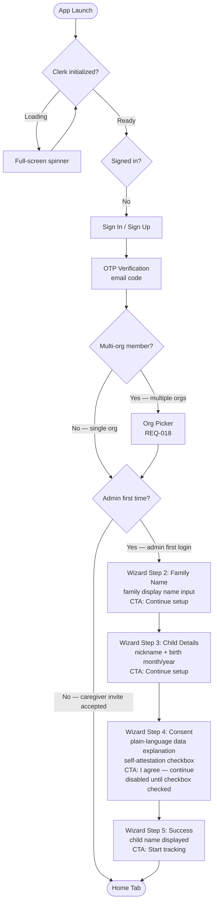
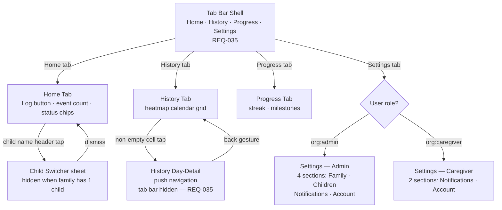

# Screen Flows — OneStepTwo

> Source: `.planning/phases/04-ui-ux-design/04-UI-SPEC.md` §Screen Inventory, §Navigation Patterns
> Last updated: 2026-06-29

## Auth + Onboarding Flow

**Fallback path (plain text — for viewers without Mermaid support):**

1. App launches → Clerk SDK initialises (full-screen spinner while Clerk.isInitialized = false)
2. Clerk ready → check signed-in state
3. Not signed in → Sign In / Sign Up screen
4. OTP verification — email code entry
5. Multi-org check → if member of more than one Clerk org, show Org Picker (REQ-018)
6. Admin first-time check:
   - Caregiver (accepted Clerk invite) → skip wizard entirely → Home Tab
   - Admin, first login → enter onboarding wizard
7. Wizard Step 2: family display name input (CTA: "Continue setup") — tab bar hidden
8. Wizard Step 3: first child nickname + birth month/year selectors (CTA: "Continue setup") — tab bar hidden
9. Wizard Step 4: Consent — plain-language data explanation + self-attestation checkbox ("I confirm I am the parent or legal guardian of this child and am 18 years of age or older."); CTA "I agree — continue" remains disabled until checkbox is checked — tab bar hidden, no back navigation allowed from this step
10. Wizard Step 5: Success — child name confirmed, CTA "Start tracking" — tab bar hidden
11. Step 5 CTA → replaces navigation stack root with main app Tab Shell; back stack cleared, user cannot navigate back to wizard or auth screens

## Main App Navigation

> **Tab bar visibility (REQ-035):** The bottom tab bar is hidden during the onboarding wizard (all 5 steps) and during the History Day-Detail full-screen push view. It is visible on all four main tabs (Home, History, Progress, Settings) and on the Settings sub-screens.

## Home Tab Interaction Flow (Log → Toast → Sheet)

1. User taps the **Log button** on the Home Tab
2. **SQLDelight write fires immediately** — event row inserted locally with no network dependency; `sync_status = 'pending'`
3. **Haptic fires on release** + button scales 0.95 → 1.0 (spring animation, 200ms release)
4. **Toast slides up** from above tab bar — 200ms enter animation; body text: "Logged. Add a type?"
5. User taps an **event-type chip** in the toast (Pee / Poo / Both / Accident / Tried) → `event_type` written to SQLDelight → toast exits (150ms exit animation)
6. User taps **"add details"** in the toast (or taps a pending-details event card later) → **bottom sheet opens** (platform default timing: Android `ModalBottomSheet` ~300ms; iOS `.sheet` natural spring)
7. User fills event-type selector, note field, and optionally adjusts logged time, then taps **"Save details"** → sheet dismisses, event row updated in SQLDelight

> **Offline note:** Steps 2, 5, and 7 all write to SQLDelight only. Network sync occurs separately when connectivity is available. The interaction chain completes fully offline.

## Platform-Specific Navigation Notes

> **Platform exception (D-10 — Back navigation):** iOS uses `NavigationStack` swipe-from-left-edge gesture; Android uses the system predictive back gesture. No custom back button is added on either platform. Both gestures correctly pop the back stack for pushed detail screens (e.g. History Day-Detail).

> **Tab switch transition (D-32):** Tab switches use a cross-dissolve fade of 120ms. Tab state is preserved across switches — switching from History back to Home does not re-create composables or views. Android uses `AnimatedContent` with `fadeIn(tween(120)) + fadeOut(tween(120))`; iOS uses `TabView` with the system cross-fade (no custom transition required).

> **Onboarding wizard linearity:** Steps progress forward only via push navigation within a single `NavigationStack`. No back navigation is allowed from the consent step (Step 4) — the back gesture is disabled at this point in the wizard. Step 5 (Success) does not push; it **replaces the navigation stack root** with the main app Tab Shell so the wizard cannot be re-entered via back.

> **Auth → main app transition:** After sign-in or wizard completion, the navigation stack root is replaced with the main app `TabShell`. The back stack is fully cleared — users cannot navigate back to auth screens. This matches the existing Phase 3 Android pattern: `popUpTo(0) { inclusive = true }` in `AppNavigation.kt`.
